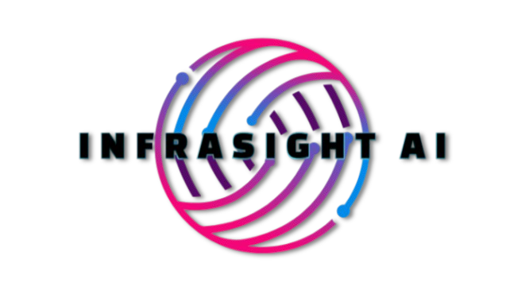

InfraSight AI: Real-Time Civic Issue Detection

  

  <strong>An AI-powered platform that transforms city surveillance into a proactive infrastructure monitoring network.</strong>

  
  
  
  
  

---

## 🚀 The Solution in Action

InfraSight AI automatically detects civic issues from camera feeds and citizen reports, streamlining the process from detection to resolution. Our system provides a live dashboard and interactive map for officials to make data-driven decisions.

*Put a high-quality GIF of your application dashboard or map in action here. This is the most powerful way to show what your project does.*

## ✨ Key Features

- **🤖 Automated AI Detection:** Real-time identification of civic issues from video streams using a custom-trained YOLOv8 model.

- **📝 Intelligent Citizen Reporting:** A web portal for citizens to submit reports with images, which are verified and analyzed by our AI. 

- **🗺️ Live Interactive Map:** A geospatial dashboard for officials to view the real-time location and status of all reported issues.

- **📊 Data-Driven Analytics:** A comprehensive dashboard that provides insights into issue hotspots, resolution times, and departmental performance.

- **🔔 Real-time Alerts:** Automated notifications sent to the correct municipal departments via the Twilio API.

🧠 Our Custom AI Model
The core of InfraSight is a powerful YOLOv8 model we trained on a massive, 5-class dataset of over 74,000 images tailored for urban environments.

Pothole

Garbage Pile

Street Flooding

Illegal Parking

Debris

[Icon for Pothole]

[Icon for Garbage]

[Icon for Flooding]

[Icon for Parking]

[Icon for Debris]

🛠️ Technology Stack
Category

Technology

Backend

 

Frontend

 

Database

 

AI/ML

 

Deployment

🏗️ Architecture
Our system uses a dual-stream pipeline to process data from both automated camera feeds and citizen reports. All data is unified and stored in a geospatial database, which powers the frontend dashboard and alerting systems.

🚀 Getting Started
This project is fully containerized and easy to run locally.

Prerequisites
Docker Desktop installed and running.

Git for cloning the repository.

Setup Instructions
Clone the Repository:

git clone [https://github.com/your-username/infrasight-ai.git](https://github.com/your-username/infrasight-ai.git)
cd infrasight-ai

Configure Environment Variables:

Navigate to the backend directory.

Copy the example environment file: cp .env.example .env (on Windows, use copy .env.example .env)

Open the new .env file and fill in your credentials for the Database, Google, and Twilio.

Place Your Trained Model:

Download your custom-trained best.pt model file.

Place it inside the backend/models/ directory.

Build and Run with Docker Compose:

From the project's root directory, run:

docker-compose up --build

Access the Application:

Frontend: http://localhost:3000

Backend API Docs: http://localhost:8000/docs

🔮 Future Vision
Expand Detection: Train the model on new classes like damaged signs and open manholes.

Predictive Analytics: Use historical data to predict future problem hotspots.

Citizen Feedback Loop: A public portal for citizens to track the status of their reports.

👥 Team
Shadow Legion
